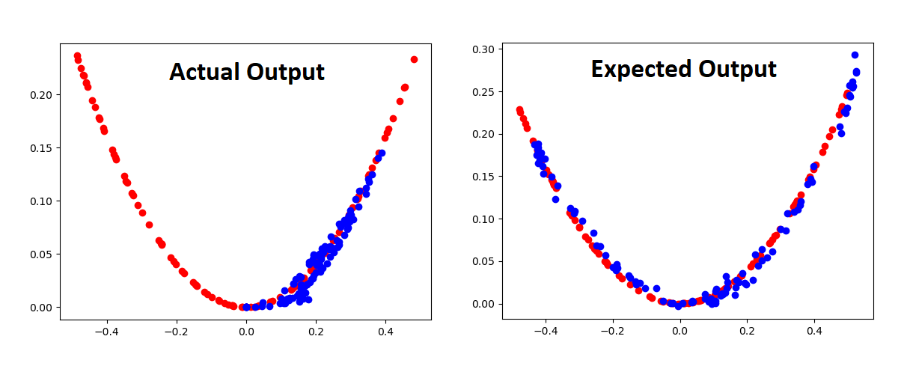
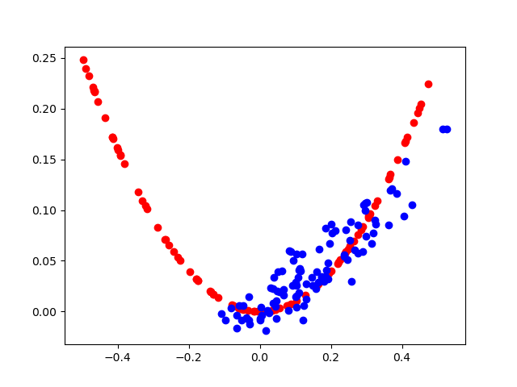
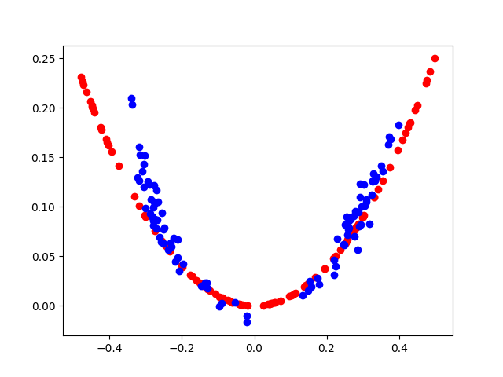
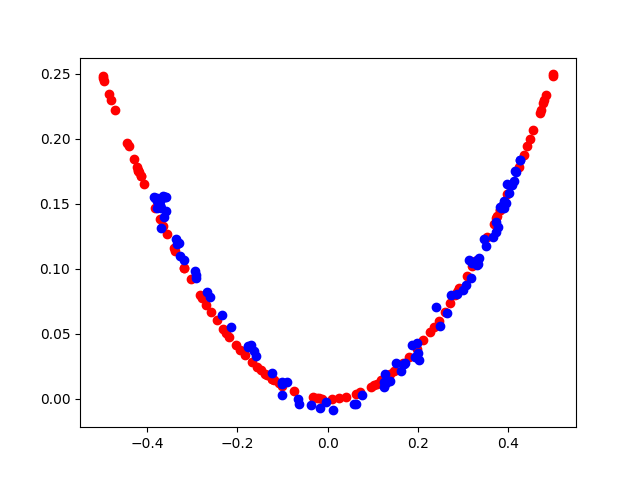
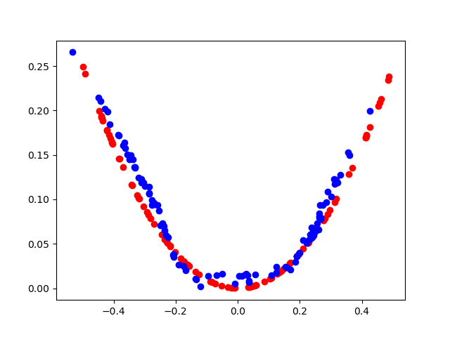
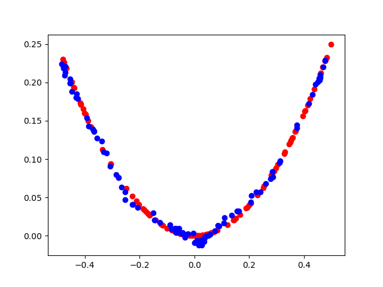

# Problem Statement
Given the sample code, we need to find out the mistake and need to fix it to produce the desired results. The current code is showing the output shown in the below figure (actual output), we need to modify the program in such a way that it should generate the expected output.


## Program Specification
The real samples are generated from the gaussian distribution in the interval [0,1) (means greater than or equal to 0 and less than 1). Value (0.5) is substracted to spread the data both positive and negative axis. This also makes the problem non-linear as the out of -0.5<sup>2</sup> and 0.5<sup>2</sup> is same. 

The generator, discriminator and their combination gan network is given. The current code is working but not producing the desired output.

# Solution Approach
The problem lies the way generator network is built. It is fine to use the sigmoid activation in the descriminator network as it has to classify between the real and fake sample. But it is not required in the generator network as the generator network shold produce the value both from positive and negative axis. If we use sigmoid, it would always produce values between 0 and 1, and therefore we sould not be getting any negative values. This is the reason the actual output corresponds to only positive axis. This is the reason we changed the *nn.Sigmoid()* to *nn.Tanh()*. 
```
discriminator = nn.Sequential(nn.Linear(n_inputs, h_dim), nn.LeakyReLU(0.1), nn.Linear(h_dim, 1), nn.Sigmoid())
generator = nn.Sequential(nn.Linear(latent_dim, h_dim), nn.LeakyReLU(0.1), nn.Linear(h_dim, n_inputs), nn.Sigmoid())

```
The updated code is given below. We further did several experiments with the latent dimension and the hidden units, based on the outcomes, we set their values to 32 and 128 respectively. The output is stored at the gap of 2000 iterations and shown below.

```
generator = nn.Sequential(nn.Linear(latent_dim, h_dim), nn.LeakyReLU(0.1), nn.Linear(h_dim, n_inputs), nn.Tanh())

```

# Output
The initial results are not that great but as program completed 6000 iterations, we received the betterment in the results. These results vary in each run as when we sample the latent vector, its values are changing (its random) and this is impacting the results. However the nature of the system remains save (gets better as training progress). The first plot shows the output after 2000, second, third, fourth and fifth shows the output after 4000, 6000, 8000 and 10,000 iterations.

    


