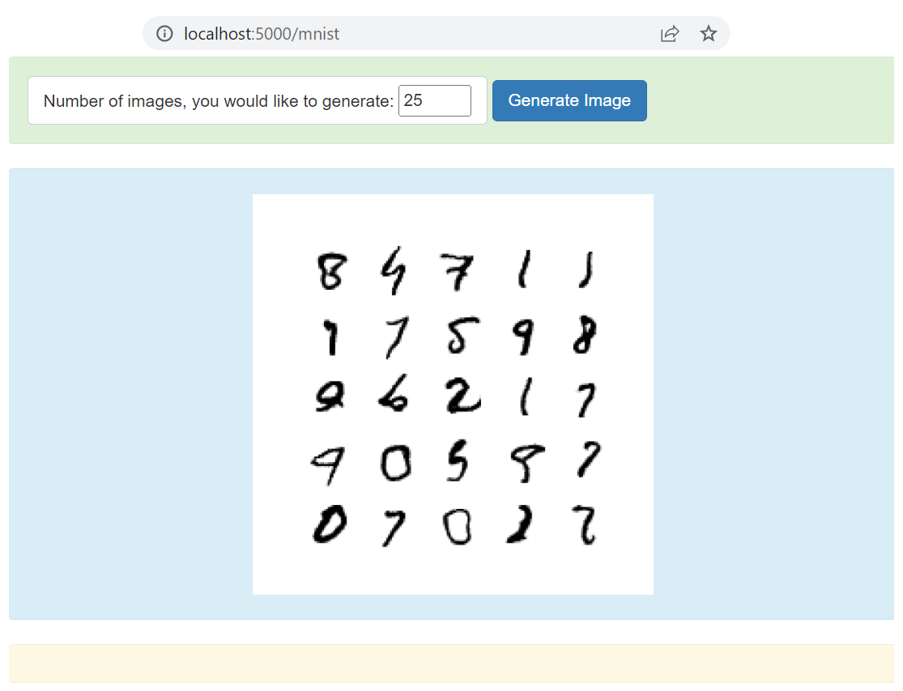

# Problem Definition
We need to extend the same code for generating the synthetic hand written digits. We can use the MNIST dataset to train the network.

# Solution Approach
We used convolutional neural network to design both generator and discriminator networks. The design architecture for both the networks is given below.
1. Discriminative Netowrk: This netowrk is designed with the intension to take the 28x28 dimensional MNIST image and then classify to real or fake class. 
```
	model = keras.Sequential()
	model.add(layers.Conv2D(64, (3,3), strides=(2, 2), padding='same', input_shape=in_shape))
	model.add(layers.LeakyReLU(alpha=0.2))
	model.add(layers.Dropout(0.4))
	model.add(layers.Conv2D(64, (3,3), strides=(2, 2), padding='same'))
	model.add(layers.LeakyReLU(alpha=0.2))
	model.add(layers.Dropout(0.4))
	model.add(layers.Flatten())
	model.add(layers.Dense(1, activation='sigmoid'))
	# compile model
	opt = Adam(learning_rate=0.0002, beta_1=0.5)
	model.compile(loss='binary_crossentropy', optimizer=opt, metrics=['accuracy'])
```
2. Generative Network: This network takes the latent vector as input and then generates the 28x28x1 hand written digit (at the output layer).
```
	model = keras.Sequential()
	# foundation for 7x7 image
	n_nodes = 128 * 7 * 7
	model.add(layers.Dense(n_nodes, input_dim=latent_dim))
	model.add(layers.LeakyReLU(alpha=0.2))
	model.add(layers.Reshape((7, 7, 128)))
	# upsample to 14x14
	model.add(layers.Conv2DTranspose(128, (4,4), strides=(2,2), padding='same'))
	model.add(layers.LeakyReLU(alpha=0.2))
	# upsample to 28x28
	model.add(layers.Conv2DTranspose(128, (4,4), strides=(2,2), padding='same'))
	model.add(layers.LeakyReLU(alpha=0.2))
	model.add(layers.Conv2D(1, (7,7), activation='sigmoid', padding='same'))
```
3. GAN Model: The GAN model is made as we stacked generative model followed by the discriminative model. The code snipset is goven below. The discriminator is trained individually while we trained the combined network, their weights are not going to change as we disabled their training. We did it intentionally, as we want to use the discriminator network only to predict that the samples are real or fake. While doing so, we label the fake samples as real samples. If the discriminator network works well then it would mark these samples as fake (giving output 0). The when it produces the output 0 for the fake sample which is represented as 1 (as real sample). Network will treat this as misclassification and backpropogate the error to improve the results. When the results are improved, we will see that the network is now start predicting the fake as real. This we consider our success criteria (the discriminator accuracy should be low).
```
	# make weights in the discriminator not trainable
	discriminator.trainable = False
	# connect them
	model = keras.Sequential()
	# add generator
	model.add(generator)
	# add the discriminator
	model.add(discriminator)
	# compile model
	opt = Adam(learning_rate=0.0002, beta_1=0.5)
	model.compile(loss='binary_crossentropy', optimizer=opt)
```

# Output
There are few of the samples to show how the system generating the synthetic images. We trained the netowkr till 500 epochs. 


# Running Flask Server
We have further created a REST API and the web application to generate these images on user request. The user may select, how many images, she/he wants to generate, the system will then generate those many images. The example is shown below.




