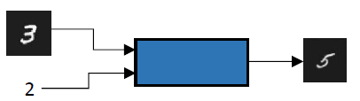
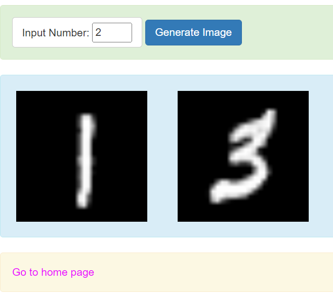
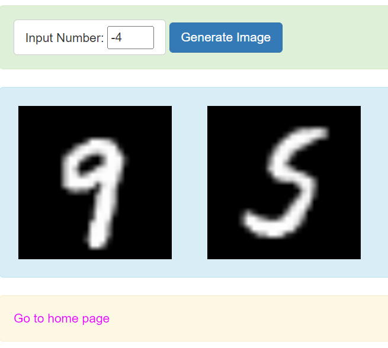

# Problem Definition
Design and implement the system shown in below figure where: The inputs are IMG (an image from the MNIST dataset with a value X) and ALPHA (an increment value as integer). The output is an MNIST-like image with a value Y = X + ALPHA.


# Solution Approach 
We used multi-modal approach to solve this problem, we first designed a image classification system to classify the input images to one of those 10 classes (0-9). Further, we took the prediction and the input alpha and summed them to find out Y. Once we got the number Y, we used conditional GAN to generate the image as output. The details about both the networks are given below.
## Image Classification
We created a simple convolutional neural network with 3 conv layer, 2 pooling layer, and 2 fully connected layer. The system has received 99.27% validation accuracy. 
```
model = Sequential()
model.add(Conv2D(32, (3, 3), activation='relu', kernel_initializer='he_uniform', input_shape=(28, 28, 1)))
model.add(MaxPooling2D((2, 2)))
model.add(Conv2D(64, (3, 3), activation='relu', kernel_initializer='he_uniform'))
model.add(Conv2D(64, (3, 3), activation='relu', kernel_initializer='he_uniform'))
model.add(MaxPooling2D((2, 2)))
model.add(Flatten())
model.add(Dense(100, activation='relu', kernel_initializer='he_uniform'))
model.add(Dense(10, activation='softmax'))
# compile model
opt = SGD(learning_rate=0.01, momentum=0.9)
model.compile(optimizer=opt, loss='categorical_crossentropy', metrics=['accuracy'])

```
## Conditional GAN
To control the image generation process, we used contional GAN. We take an extra input (Noise) with the latent vector to generate the synthetic image. The noise helps us to control the output. The discriminator network remains similar as shown in problem-2 while the generator network has some extra steps to consume the noise. 
```
generator_in_channels = latent_dim + num_classes
layers.Dense(7 * 7 * generator_in_channels),
layers.LeakyReLU(alpha=0.2),
layers.Reshape((7, 7, generator_in_channels)),
layers.Conv2DTranspose(128, (4, 4), strides=(2, 2), padding="same"),
layers.LeakyReLU(alpha=0.2),
layers.Conv2DTranspose(128, (4, 4), strides=(2, 2), padding="same"),
layers.LeakyReLU(alpha=0.2),
layers.Conv2D(1, (7, 7), padding="same", activation="sigmoid")

```

# Output
We have hosted the model over the flask server. The below figure eloborates, how the system works. The system as asked in the problem definition accepts, alpha and an random input image from the MNIST dataset and result the output images (the sum of two numbers). The system work seven for substraction.




